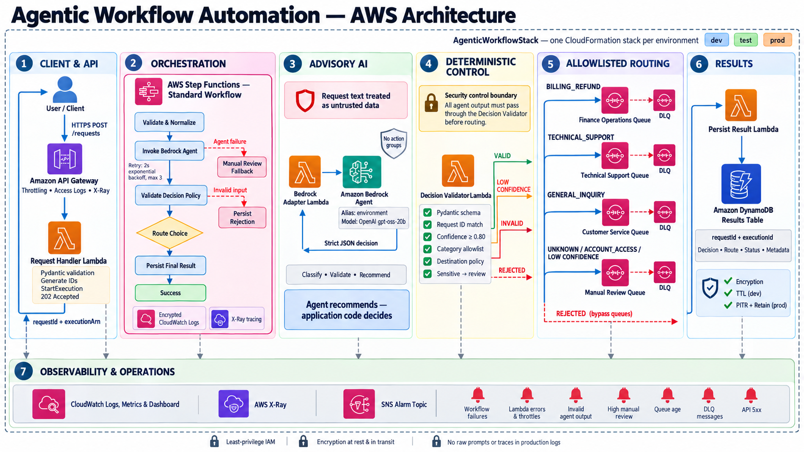

# Architecture

API Gateway accepts `POST /requests`. The request Lambda schema-validates and starts a
deterministically named Standard Step Functions execution. The workflow validates again at
its trust boundary, invokes the Bedrock Agent through an adapter, applies deterministic policy,
routes to one of four CDK-created queues, and persists the bounded result in DynamoDB.

The Bedrock Agent has no action groups and no infrastructure identifiers. Its output is advisory.
Only Pydantic-validated enum values enter policy evaluation, and only the Step Functions definition
maps those values to queue resources.

All resources for an environment are in one `AgenticWorkflowStack`; custom constructs provide
code organization without creating additional CloudFormation stacks.

## Idempotency

The API derives a stable Step Functions execution name from `requestId`. A duplicate ID maps to
the same execution ARN and returns `202`. Step Functions prevents a second execution with that
name, so clients should reuse an ID only when retrying the same logical request.

## Model choice

The default is `openai.gpt-oss-20b-1:0`, the smaller OpenAI open-weight model available through
Amazon Bedrock. Model and regional access must be confirmed before deployment. The model remains
environment-configurable because availability and Bedrock Agent behavior vary by region.
